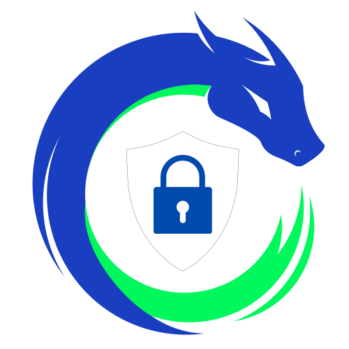

<p align="center">
    
</p>
<p align="center">
    <h1 align="center">SAFENET</h1>
</p>
<p align="center">
    <em><code>Donnons du pouvoir à votre cybersécurité : Informez-vous, protégez-vous.</code></em>
</p>
<p align="center">
	
	
	
	
<p>
<p align="center">
		<em>Developed with the software and tools below.</em>
</p>
<p align="center">
	
	
	
	
</p>
<hr>

## Quick Links

> - [ Overview](#-overview)
> - [ Features](#-features)
> - [ Repository Structure](#-repository-structure)
> - [ Modules](#-modules)
> - [ Getting Started](#-getting-started)
>   - [ Installation](#-installation)
>   - [ Running SafeNet](#-running-SafeNet)
>   - [ Tests](#-tests)
> - [ Project Roadmap](#-project-roadmap)
> - [ Contributing](#-contributing)
> - [ License](#-license)
> - [ Acknowledgments](#-acknowledgments)

---

## Overview

SafeNet est un site web dédié à l'enseignement des bases de l'informatique et de la cybersécurité aux novices. Il propose des cours simples et des activités pratiques pour sensibiliser les utilisateurs aux risques sur Internet, y compris les attaques courantes. L'objectif est de fournir une formation accessible pour renforcer la sécurité personnelle en ligne.

---

## Features

**Cours Simples et Basés** : Enseignement des bases de l'informatique et de la cybersécurité.

**Sensibilisation aux Risques** : Informations sur les menaces courantes sur Internet.

**Activités Pratiques** : Exercices interactifs pour renforcer les connaissances.

**Interface Accessible** : Conçu pour les utilisateurs novices.

**Protection Personnelle** : Conseils pour améliorer la sécurité en ligne personnelle.

---

## Repository Structure

```sh
└── SafeNet/
    ├── LICENSE.md
    ├── README.md
    ├── database.php
    ├── img
    │   ├── SafeNet-Logo.png
    │   ├── SafeNet_Logo.png
    │   ├── SafeNet_Logo.svg
    │   ├── SafeNet_Logo_1.png
    │   ├── SafeNet_Logo_1.svg
    │   ├── SafeNet_Logo_2.png
    │   ├── SafeNet_Logo_2_dark.png
    │   ├── SafeNet_Logo_2_light.png
    │   ├── logo with text.png
    │   ├── mail.gif
    │   ├── module
    │   │   ├── module-1
    │   │   │   ├── Cover.jpeg
    │   │   │   ├── DDoS.gif
    │   │   │   └── DoS.gif
    │   │   └── module-2
    │   │       └── Cover.jpeg
    │   └── pexels-photo-1072179.jpeg
    ├── index.php
    ├── login
    │   ├── login.css
    │   ├── login.html
    │   └── login.js
    ├── mainpage
    │   ├── mainpage.css
    │   ├── mainpage.html
    │   └── mainpage.js
    ├── signup
    │   ├── signup.css
    │   ├── signup.html
    │   └── signup.js
    ├── test
    │   ├── Demo_1.php
    │   ├── Demo_2.php
    │   ├── mail.php
    │   ├── test_loginpage.php
    │   ├── test_mainpage.php
    │   ├── test_signuppage.php
    │   └── test_two-factorpage.php
    └── zabbix
        ├── docker-compose.yml
        ├── docker-compose.yml.swp
        └── env
```

---

## Getting Started

***Requirements***

Ensure you have the following dependencies installed on your system:

* **PHP**: 8.2.13 or sup

### Installation

1. Clone the SafeNet repository:

```sh
git clone https://github.com/Cronix2/SafeNet
```

2. Change to the project directory:

```sh
cd SafeNet
```

3. Install the dependencies:

```sh
composer install
```

### Running SafeNet

Use the following command to run SafeNet:

```sh
php main.php
```

### Tests

To execute tests, run:

```sh
vendor/bin/phpunit
```

---

## Project Roadmap

- [X] Premier push du projet.
- [X] Ajout des fonctions de test.
- [X] Ajout des réseaux sociaux.
- [X] Division du code en fichiers distincts.
- [X] Amélioration de la page avec barre de recherche et footer.
- [X] Ajout de la licence.
- [X] Mise à jour du logo SafeNet et des icônes de pied de page.
- [X] Mise à jour du logo dans le footer.
- [X] Réorganisation du style dans `test_mainpage.html`.
- [X] Mise à jour des styles de boutons et du logo de la barre de navigation.
- [X] Ajout d'exemples d'attaques DoS et DDoS avec des GIFs.
- [X] Mise à jour des titres de page, des liens de favicon et du style.
- [X] Amélioration de la validation des entrées et des commentaires pour les questions de quiz.
- [X] Mise à jour de l'image de couverture du cours pour le module 1.
- [X] Ajout de liens de navigation incluant un lien vers la page d'accueil.
- [X] Mise à jour du comportement des boutons et du style.
- [X] Mise à jour de l'image du logo pour la cohérence du thème sombre.
- [X] Mise à jour du contenu des tâches avec de meilleures explications sur les attaques par force brute et par dictionnaire.
- [X] Réorganisation de la soumission de formulaire sur la page d'inscription pour une meilleure lisibilité du code et une meilleure expérience utilisateur.

---

## Contributing

Contributions are welcome! Here are several ways you can contribute:

- **[Submit Pull Requests](https://github.com/Cronix2/SafeNet/blob/main/CONTRIBUTING.md)**: Review open PRs, and submit your own PRs.
- **[Join the Discussions](https://github.com/Cronix2/SafeNet/discussions)**: Share your insights, provide feedback, or ask questions.
- **[Report Issues](https://github.com/Cronix2/SafeNet/issues)**: Submit bugs found or log feature requests for Safenet.

<details closed>
    <summary>Contributing Guidelines</summary>

1. **Fork the Repository**: Start by forking the project repository to your GitHub account.
2. **Clone Locally**: Clone the forked repository to your local machine using a Git client.
   ```sh
   git clone https://github.com/Cronix2/SafeNet
   ```
3. **Create a New Branch**: Always work on a new branch, giving it a descriptive name.
   ```sh
   git checkout -b new-feature-x
   ```
4. **Make Your Changes**: Develop and test your changes locally.
5. **Commit Your Changes**: Commit with a clear message describing your updates.
   ```sh
   git commit -m 'Implemented new feature x.'
   ```
6. **Push to GitHub**: Push the changes to your forked repository.
   ```sh
   git push origin new-feature-x
   ```
7. **Submit a Pull Request**: Create a PR against the original project repository. Clearly describe the changes and their motivations.

Once your PR is reviewed and approved, it will be merged into the main branch.

</details>

---

## License

This project is protected under the [MIT](https://fr.wikipedia.org/wiki/Licence_MIT) License. For more details, refer to the [LICENSE](https://github.com/Cronix2/SafeNet/blob/main/LICENSE.md) file.

---
